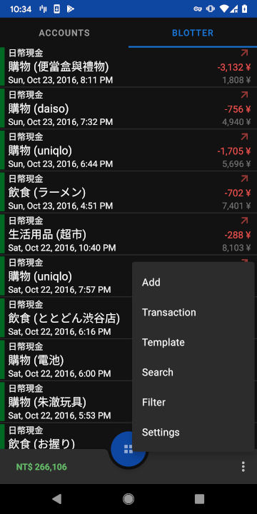

# Financisto

## About

Financisto is an open-source personal finance tracker for Android platform.

Financisto is great and works well.

However its UI is a bit old. I forked the project to add some modifications for myself, ie: update UI. Unfortunately, it is not easy to migrate to mordern UI, and I found some functions are broken by my modifications. This repo is pretty **buggy**. Since only I am using this, so it should be fine.

## Features

- Multiple accounts, multiple currencies 
- Home currency and exchange rates
- Transfers with downloadable rates
- Scheduled & recurring transactions
- Split transactions
- Hierarchical categories with custom attributes
- Recurring budgets
- Projects and payees
- Filtering and reporting
- Cloud backup (Dropbox, Google Drive)
- Automatic daily backups
- QIF/CSV import/export

## License

See [License](license.txt)
